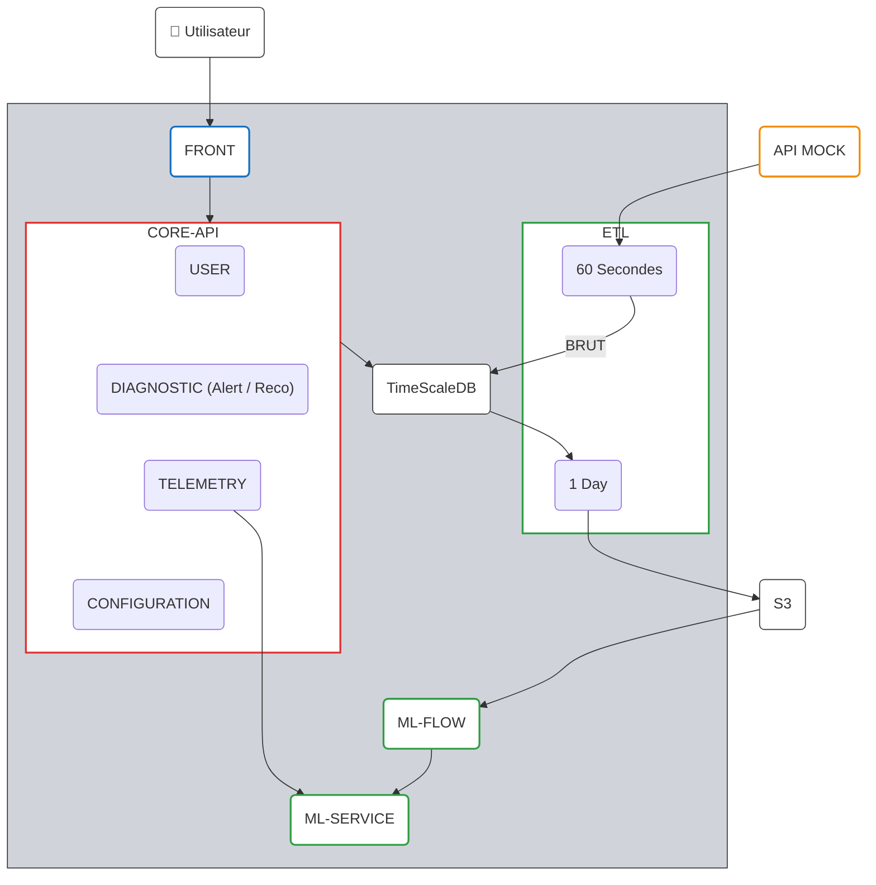

# Architecture applicative

```mermaid
flowchart TD
    USER_ACTOR("👤 Utilisateur")
    API_MOCK("API MOCK")

subgraph PLATFORM[" "]
direction TB
FRONT("FRONT")

subgraph CORE["CORE-API"]
direction TB
USER("USER")
DIAG("DIAGNOSTIC (Alert / Reco)")
TELEM("TELEMETRY")
CONF("CONFIGURATION")
USER ~~~ DIAG ~~~ TELEM ~~~ CONF
end

MLSERVICE("ML-SERVICE")

subgraph ETL["ETL"]
direction TB
E60("60 Secondes")
E1D("1 Day")
E60 ~~~ E1D
end

TSDB("TimeScaleDB")
MLFLOW("ML-FLOW")
end

S3("S3")

USER_ACTOR --> FRONT
FRONT --> CORE
TELEM --> MLSERVICE
CORE --> TSDB

API_MOCK --> E60
E60 -->|BRUT| TSDB
TSDB --> E1D
E1D --> S3

S3 --> MLFLOW
MLFLOW --> MLSERVICE

ETL ~~~ TSDB ~~~ MLFLOW

classDef front fill:#fff,stroke:#1971c2,stroke-width:2px
classDef core fill:#fff,stroke:#e03131,stroke-width:2px
classDef green fill:#fff,stroke:#2f9e44,stroke-width:2px
classDef orange fill:#fff,stroke:#f08c00,stroke-width:2px
classDef plain fill:#fff,stroke:#333,stroke-width:1px
class FRONT front
class CORE core
class ETL,MLSERVICE,MLFLOW green
class API_MOCK orange
class TSDB,S3,USER_ACTOR plain
style PLATFORM fill:#d0d4da,stroke:#333
```